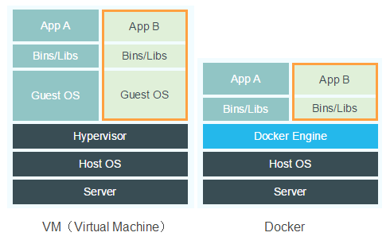

## Container or virtual machine?

After Docker’s sudden success - virtualization based on containers - many people are asking about a possible migration from the virtual machine model to containers.

We answer this calmly: **Both!**

Both are virtualization methods, but work in different “layers”. It’s worth to detail each solution to make clear that they are not necessarily competition. 

### Virtual machine

An old concept, coming from the Mainframes on mid 1960s. Each operator had the vision of accessing a dedicated machine but, in fact, every Mainframe resource was shared to all operators. 

The goal of the model is to share physical resources amongst several isolated environments, and each one of them is guarding a whole machine: with memory, disk, processor, network and other peripherals, all delivered via virtualization abstraction. 

It’s like if inside the physical machine, smaller and independent machines were created. Each one has its own operational system that, in turn, interacts with the virtual hardwares that were delivered by the virtualization model in the machine level. 

It’s important to say: the operational system installed in the virtual machine will interact with the virtual hardware, not the real ones.

While this model evolved, the softwares that implement the solution could offer more features, such as better interface to manage virtual environments and high availability using several physical hosts. 

With the new features for managing environments on virtual machines, it’s possible to specify the amount of physical resource each virtual environment uses and even to gradually increase it if necessary. 

Currently, virtual machines are a reality for any organization that requires TI environments, for it facilitates the management of physical machines and sharing amongst several environments necessary for the basic infrastructure. 

### Container

This virtualization model is on the operational system level; that is, different from a virtual machine, a container does not view the whole machine, it’s just a running process in a kernel shared amongst all other containers. 

It uses the namespace to provide the due isolation of RAM memory, processing, disk and network access. Even when shared in the same kernel, this running process views the use of a dedicated operational system.  

It’s a relatively old virtualization model. In mid 1982, chroot was already doing something we can consider virtualization on operational system level, and in 2008, LXC was doing something relatively similiar to the current Docker. Yet, in the beginning, Docker was using LXC but today it has its own interface in order to access namespace, cgroup and others. 

Being an innovative solution, Docker brings up several services and new facilities that make the model much more attractive. 

The LXC environment configuration was not a simple task; it was necessary some technical knowledge to create and maintain an environment with it. As Docker arrived, this process became much simpler. Just install the binary, download the images and execute them. 

Other Docker novelty was the creation of the “images” concept. Roughly, we can describe images as the static definitions of what containers must be in initialization. They are like ambience photographs. Once they’re instantiated and put into execution, they assume the role of containers; they leave the definition abstraction and turn into running processes, within an isolated context. They see an operational system dedicated to themselves, but in fact they share the same kernel.  

Along with the easiness of using containers, Docker put together the concept of cloud, that offers the service of loading and “downloading” Docker images. It’s a web application that provides repository of ready environments, making available an enormous level of environment sharing.

By using Docker’s cloud service, we can realize that adopting the container model surpasses the technical issue and introduces subjects such as environment management and update; now it’s possible to easily share changes and provide a centralized management of environment definitions. 

Using Docker cloud now makes possible to provide lighter testing environments, allowing you to, in a meeting with your boss, for instance, download the solution of a problem he/she explains and show it to him/her before he/she leaves the room. It allows also that you make available a pattern of best practices to a given service and share it with everybody in your company, where you can get feedbacks and perform modifications through time.

### Conclusion

With the data presented we realized that the conflict point between solutions is low. They can and usually will be adopted together. You can provide a physical machine with a virtual machine server, in which host virtual machines will be created that, in turn, will have Docker installed. In this Docker, they will make available environments and their respective services, each one in a container. 

See that we’ll have several isolation levels. In the first one, the physical machine, that was separated in various virtual machines, that is, we already have our layer of operational systems interacting with distinct virtual hardware, such as virtual network card, disks, processor and memory. In this environment, we would only have installed the basic operational system and Docker. 

In the second isolation level, we have Docker downloading ready images and providing running containers that, in turn, create new isolated environments, at the level of processing, memory, disk and network. In this case, we can have in the same virtual machine a web application environments and a database. But in different containers (and that wouldn’t be a best practice issue for service management), a lot less security. 

If these containers are replicated between virtual machines, it would be possible to provide high availability with no huge costs, that is, using an external balancer and making available the cluster of persisted data via database. 

With all this facility using a few commands, resources and knowledge, we just need a little bit of time to change the paradigm of managing actives and patience to face the new issues within the model.
