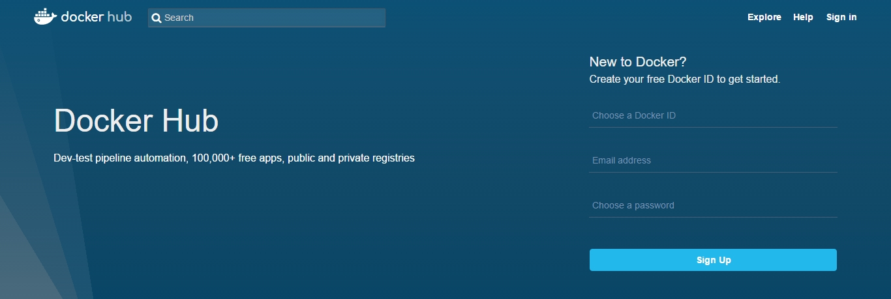
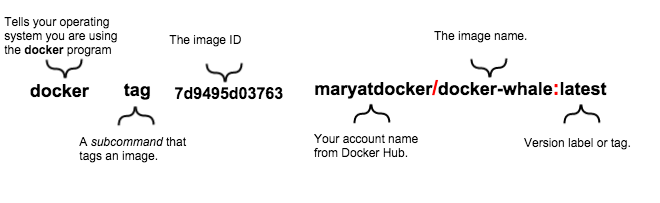

# Dockerhub

You are learning to do pretty cool stuff, building your image, what about sharing with others what you are doing? This can be helpful for you in the future, this is how communities grow strong. That's why **Dockerhub** exists.

#### What is Dockerhub?

Dockerhub is a shared repository of Docker images. In the previous chapter, you read a little about official images and not-official, is on Dockerhub that the **Dockerfiles** are distributed for the community with the object to facilitate the build of your docker environment.

Docker, Inc. sponsors a dedicated team that is responsible for reviewing and publishing all content in the [Official Images](https://docs.docker.com/docker-hub/official_images/).This team works in collaboration with upstream software maintainers, security experts, and the broader Docker community.

Here some examples of Official Images, mantained by the Docker team:

+ [MySQL](https://hub.docker.com/_/mysql/)
+ [Nginx](https://hub.docker.com/_/nginx/)
+ [Python](https://hub.docker.com/_/python/)
+ [Node](https://hub.docker.com/_/node/)
+ [WordPress](https://hub.docker.com/_/wordpress/)

You can explore the [complete list](https://hub.docker.com/explore/) of images later.

#### Creating your account and a repository

Now that you are more interested, let's create our account on the platform. This process can only be done using a Browser on the Dockerhub [register page](https://hub.docker.com/register/), which means, that it's not possible to create an account through the command line.



With the page open you need to provide a new ID to Docker, (username), a valid e-mail address and password. The browser will redirect you to the `Welcome to Docker Hub`. After the register, you need to validate your e-mail searching for the `Please confirm email for your Docker ID` if you didn't find it check also your spam box. 

Open the confirmation e-mail and click on `Confirm Your Email`, the browser will open the Dockerhub and redirect you to your profile. In this page click on `Create Repository` and fill the small form with the name of the repository, brief description, certified that it's public so other people can check it.

Free accounts can have only 1 private repository. If you need more private repositories, check out the [plans](https://hub.docker.com/account/billing-plans/) 

**Obs:** If you are hosting a sensitive information application **NEVER** use a public repository. 

### How to publish the image to Dockerhub

Now that you already have your account and your repository, let's push it. If this concept it's not fully clear, try to make parallel thinking on pushing a project to Github using git, as this is what we will be doing. When utilizing the command `docker image ls` we can see all the images stored locally on our workstation. Let's imagine that we want to publish the image **docker-is-cool** to the repository that we just created.

```
REPOSITORY TAG IMAGE ID CREATED SIZE
docker-is-cool latest 8d9495d05463 38 minutes ago 193.4 MB
ambientum/node 6 cee61c8e3d01 2 weeks ago 346 MB
nginx stable-alpine f94d6dd9b576 3 weeks ago 54 MB
```

When using the command `docker image ls` the output is similar to the above one.

#### Tagging the image

Before pushing the image to the registry, we need to tag it using the `docker tag` command. As we saw above the column **REPOSITORY** the image **docker-is-cool** does not show how is the owner. You need the [docker tag](https://docs.docker.com/engine/reference/commandline/tag/) to associate the image to your docker hub account including the `namespace` as prefix (before the image name). The command will be similar to the image below.



It works like this: Using the command `docker tag` we provide the parameters nome or ID of the image that we want to apply the tag. Our case is the **docker-is-cool**. After it we inform the ``namespace`` that is the Dockerhub account that we created previously and the image name followed by the colon `:` and the version or tag version, the example would be like this.

`docker tag docker-is-cool SEU_DOCKER_ID/docker-is-cool:latest`

You can use the command `docker image ls` again to confirm that the image is tagged properly, you will notice it on the above table with your Docker ID as a prefix, if you found it, we can now use it to push to the repository.

#### How to Push my image

Before learning how to push the image to Dockerhub we need to authenticate our user locally on the command line. Open your preferred terminal and type `docker login`, no parameters are required, it will ask you for the username and password authenticate against Dockerhub.

```
docker login

 Username: *****
 Password: *****
 Login Succeeded
```

With a succeeded login we can now use the command `docker image push`, the command will generate several outputs, don't be afraid it's normal, this happens as every layer of the image is pushed individually. When using the command the output would be similar to this one.

```
docker image push dockerID/docker-is-cool

The push refers to a repository [dockerID/docker-is-cool] (len: 1)
8d9495d05463: Image already exists
...
e9e06b06e14c: Image successfully pushed
Digest: sha256:ad89e88beb7dc73bf55d456e2c600e0a39dd6c9500d7cd8d1025626c4b985011
```

After the push, you can access your Dockerhub profile and check if the image is on your list.

#### How to pull the Image

As mentioned before the whole process is similar to the usage of git, so `docker image pull`, allow that you and others have easy access to the images from anywhere as your projects on GitHub. Although, you need to remove the local copy. Otherwise, [docker pull](https://docs.docker.com/engine/reference/commandline/pull/) will not take any action as it will check that the latest version of your image is already stored locally, as we just pushed it!

Using the command `docker images` to get the ID of the image that we want to remove, and use the command `docker images rm -f ID_IMAGE`, another option (short version) is to use the `docker rmi -f ID`, our case would be:

`docker rmi -f 8d9495d05463`

Nice, we are ready to pull the image. A nice way to do it issuing the `docker container run` command that will pull, create a container and run it locally. The command below is the one responsible for it.

`docker run DOCKERHUB_USER/docker-is-cool`

As we saw before each layer is downloaded individually, this becomes clear on the above command as the output is similar to the below one.

```
Unable to find image 'DOCKERHUB_USER/docker-is-cool:latest' locally
latest: Pulling from DOCKERHUB_USER/docker-is-cool
faecf96fd5ab: Pull complete 
...
413db2f5215b: Pull complete 
Digest: sha256:66a9155c820efd2884512ba4b6e6c20a567da6c9a4ee5efdb740
```
