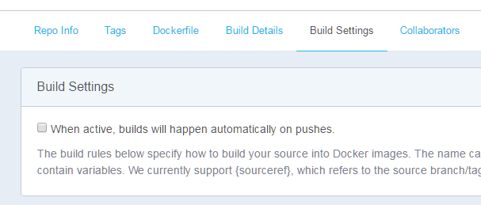
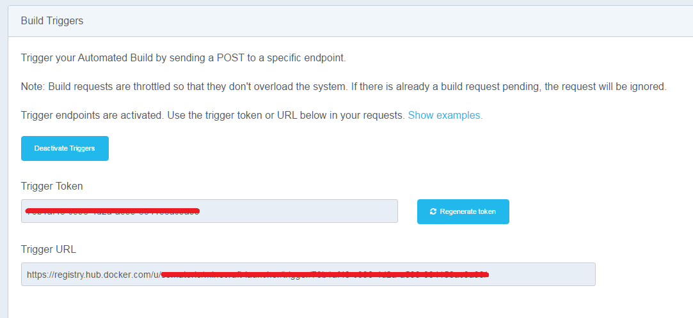

# Are you linting your Docker file? You should...

So you wrote the Dockerfile following the [Best Practices](https://docs.docker.com/develop/develop-images/dockerfile_best-practices/) and everything, and now is just enjoy it, right? What about linting your Dockerfile?

## How can I do that?
It will depend on the image build process if it's automated or manually done.

## My process is manually done, how do I do that?

In this case, you just need to install the [linter](https://github.com/replicatedhq/dockerfilelint/) (or use a [Docker image](https://hub.docker.com/r/replicated/dockerfilelint/)) and execute it against your Dockerfile.

**Example**

From the `dockerfilelit:

```
./bin/dockerfilelint <your/path/to/Dockerfile>
```
Or
```
docker run --rm -v /directory/of/dockerfile:/workdir -w /workdir replicated/dockerfilelint Dockerfile
```

**Obs:** Note that the above *docker run* is the directory where the Dockerfile is not the Dockerfile itself.

You can also use the website [FROM:latest](https://www.fromlatest.io/)

## My process is automated, how do I do that?

It depends on how your automation is done (not that will change much), if it's done about the automated build docker hub or if it's made using a CI/CD (with a push to the registry from the pipeline)

### I use the automated build! It's handy.

Using *automated build* some configurations are required.

1. Disable the option: *Build Settings > Build Settings > When active, builds will happen automatically on pushes.*
1. Enable the Triggers: *Build Settings > Build Triggers > Activate Triggers*, it will generate a *token* and a *URL* for post and active the build.
1. Configure the CI/CD to execute the linter and push to the trigger URL (as if it was the manual on test stage)

With this approach *docker hub* will not execute the build of the image on every push, and only when the CI/CD test stage ensures that everything is fine!

#### Example using circle-ci:

1. 
2. 
3. Example of circle.yml

```
machine:
 services:
 - docker

test:
 override:
 - docker run --rm -v $(pwd):/workdir -w /workdir replicated/dockerfilelint Dockerfile

deployment:
 dockerhub:
 branch: master
 commands:
 - curl -X POST <Trigger URL>
```

#### Example using travis-ci:

1. 
2. 
3. Example of .travis.yml

```
sudo: required

services:
 - docker

script:
 - docker run --rm -v $(pwd):/workdir -w /workdir replicated/dockerfilelint Dockerfile

after_success:
 - if [ "$TRAVIS_BRANCH" == "master" ]; then
 curl -X POST <Trigger URL>
 fi
```

I choose the CI/CD approach as I prefer to have total control over the build. 

Tha approach just needs to add a test stage before the build (if you do not have one) on the pipeline, as a manual stage.

## Understanding the lint result

This is the output of the linter if everything is fine:

```
File: Dockerfile
Issues: None found 👍
```

In case of something wrong was found the output of the linter is like:

```
File:   Dockerfile
Issues: 3

Line 5: forceerror
Issue  Category      Title                 Description
    1  Possible Bug  Missing Required      All commands in a Dockerfile require at least 1 argument.
                     Arguments             A line in a Dockerfile can be in any of the following formats:
                                           * * *
                                           #### `# Comment`
                                           Docker will treat any line that begins with a `#` as a comment.
                                           * * *
                                           #### `INSTRUCTION arguments`
                                           All instructions require at least 1 argument, and should be on the
                                           same line as the `INSTRUCTION`.
                                           * * *
                                           #### `RUN` continuation
                                           If a `RUN` line ends with a `\`, the next line will be treated as
                                           part of the same `RUN` arguement.
                                           * * *
                                           #### Blank or Whitespace
                                           Blank lines are allowed and will be ignored.
                                           * * *
    2  Clarity       Capitalize            For clarity and readability, all instructions in a Dockerfile
                     Dockerfile            should be uppercase.
                     Instructions          This is a convention adopted by most of the official images and
                                           greatly improves readability in long Dockerfiles.  For an example
                                           of
                                           why this makes a difference, check out the current [redis
                                           Dockerfile](https://github.com/docker-library/redis/blob/b375650fb6
                                           9b7db819e90c0033433c705b28656e/3.0/Dockerfile)
                                           and you should be able to easily see the instructions used.
    3  Possible Bug  Invalid Line          This line is not a valid Dockerfile line.
```

As you could notice, the output and the descriptions of the errors are ``Markdown``
