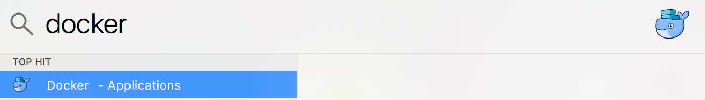
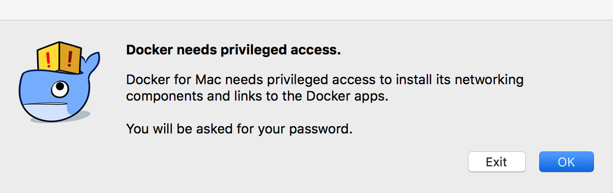
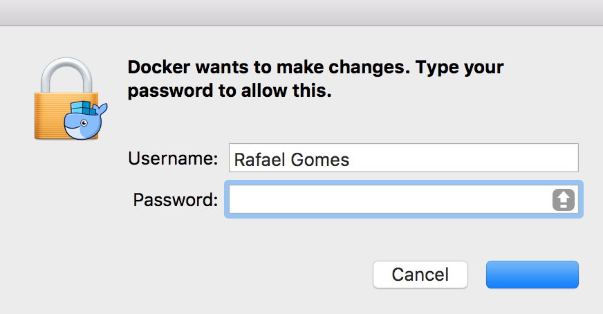

# Set up

Docker stopped being just a software to turn into a set of softwares: an ecosystem. In this ecosystem we have the following softwares:

* **Docker Engine:** It’s the base software of the solution. It is both the daemon responsible for the containers and the client used to send commands to daemon.
* **Docker Compose:** It’s the tool responsible for defining and executing multiple containers based on definition files.
* **Docker Machine:** It’s the tool that enables to create and keep Docker environments in virtual machines, cloud environments and even in a physical machine.

We are not mentioning [Swarm](https://docs.docker.com/swarm/overview/) and other tools because they’re not lined up with the goal of this book: introduction to developers.


## Setting up on GNU/Linux

We will explain the set up in the most comprehensive way, thus you can install the tools in any GNU/Linux distribution you are using.

### Docker engine on GNU/Linux

To set up Docker Engine is simple. Access your GNU/Linux terminal of choice and become root user:
```
su - root
```
or, in case of using sudo

```
sudo su - root
```

Execute the following command:

```
wget -qO- https://get.docker.com/ | sh
```
We advise you to read the script that’s being executed in your operational system. Access this [link](https://get.docker.com/) and analyse the code when you have the time.

> **WARNING**: The utilization of this convenience script is not recommended for production environments. This script does the verification of the operational system and dependencies as well as installing packages standard version packages. For environment production environments, follow the official instructions on the [Official Documentation](https://docs.docker.com/get-docker/)

This procedure takes a little while. After finishing the test, execute the following command:

```
docker container run hello-world
```

#### Solving possible problems

If the internet access on the machine goes through traffic control (that blocks the access to certain pages), you can find some problems while in the **apt-key** step. In case you are facing this issue, execute the following command:

```
wget -qO- https://get.docker.com/gpg | sudo apt-key add -
```

### Setting up Docker compose with pip

[Pip](https://en.wikipedia.org/wiki/Pip_(package_manager)) is a Python package manager and, as Docker Compose is written on this language, it is possible to set it up as it follows:

```
pip install docker-compose
```

#### Solving possible problems

If you don’t have the command **pip** installed in your computer, usually it can be set up using your package management system called **python-pip** or similar.


### Docker machine on GNU/Linux

Setting up Docker Machine is simple. Access your terminal of choice on GNU/Linux and become root user:

```
su - root
```
or, in case of using sudo

```
sudo su - root
```

Execute the command below:
```
$ curl -L https://github.com/docker/machine/releases/download/v0.10.0/docker-machine-`uname -s`-`uname -m` > /usr/local/bin/docker-machine && \
chmod +x /usr/local/bin/docker-machine
```
To test, execute the command below:

```
docker-machine version
```

Obs.: The previous example uses the latest version available when this book was published. Check if there’s some updated version verifying the [official documentation](https://docs.docker.com/machine/install-machine/).

## Setting up on MacOS

The installation of tools from the Docker ecosystem on MacOS is made through a single big package called **Docker for Mac**.

You can set it up via brew cask by following the command below:
```
brew cask install docker
```

To set up the initial configuration, you must execute the Docker application:



On the following screen, select the option **Ok**.



Your user and password will be requested to authorize the installation of softwares. Fill them in and follow the process.



To test, open a terminal and execute the command below:

```
docker container run hello-world
```

## Setting up on Windows

The installation of tools of the Docker ecosystem on Windows can be made through a single big package called **Docker Toolbox**.

**Docker Toolbox** works only on [64 bit versions](https://support.microsoft.com/en-us/kb/827218) of Windows and only for versions later than Windows 7.

It is important to highlight that it is necessary to enable the virtualization support. On Windows 8, it is possible to check it using the **Task Manager**. At the **Performance** tab, click on **CPU** to visualize the following window:


To check the virtualization support on Windows 7, use this [link](https://web.archive.org/web/20210115191932/https://www.microsoft.com/en-us/download/details.aspx?id=592) to further information.

### Setting up Docker Toolbox

Access the [**Docker Toolbox** page](https://www.docker.com/products/docker-toolbox) and download the installer for Windows. After double-clicking the installer, you will see this screen:


Just click on **Next**.


Lastly, click on **Finish**.

To test, search and execute the **Docker Quickstart Terminal** software; it will run all the required processes to start to use Docker.

In this new terminal, execute the following command to perform a test:
```
docker container run hello-world
```
